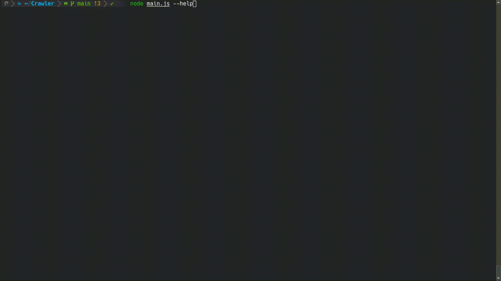

# Kankuro Crawler 

Kankuro-Crawler is a web crawler developed in NodeJS which navigate webs collecting the most important features (requests, screenshot, frames, webSockets, files...). The purpose of this project is to be a crawler template for different types of purposes. Is build using the [chrome-remote-interface](https://github.com/cyrus-and/chrome-remote-interface) to navigate the webs.

## Demo



### Table of content

- [Usage](#usage)
- [Crawler Most Important Features](#crawler-most-important-features)
- [Example Webs](#example-webs-usage)
- [FAQ](#faq)
- [Author](#author)


## Usage
This section is a introduction to the usage of the tool like a "Getting Started".

```
> git clone https://github.com/AlbertoFDR/Crawler.git
> cd Crawler/
> chmod +x install.sh
> ./install.sh
```


## Crawler Most Important Features
- Screenshot: It takes a screenshot of the web.
- Frames: Gather the frames in the page.
- Requests: Collect the requests.
- Any interstitial page.
- Javascript created dialogs.
- WebSockets: Gather the ws communication if any.
- Files: Download the files of the page (HTML,JS,CSS,Wasm...).
- Any window open.


## Example Webs Usage
- WebSockets: There are two versions, one with plaintext communication and the other one with Base64. Sudo is to use the port 80.
```
> pip3 install websockets
> sudo ./script.sh 
```


## FAQ

## Authors
- Alberto FDR: [Web](https://albertofdr.github.io/)

